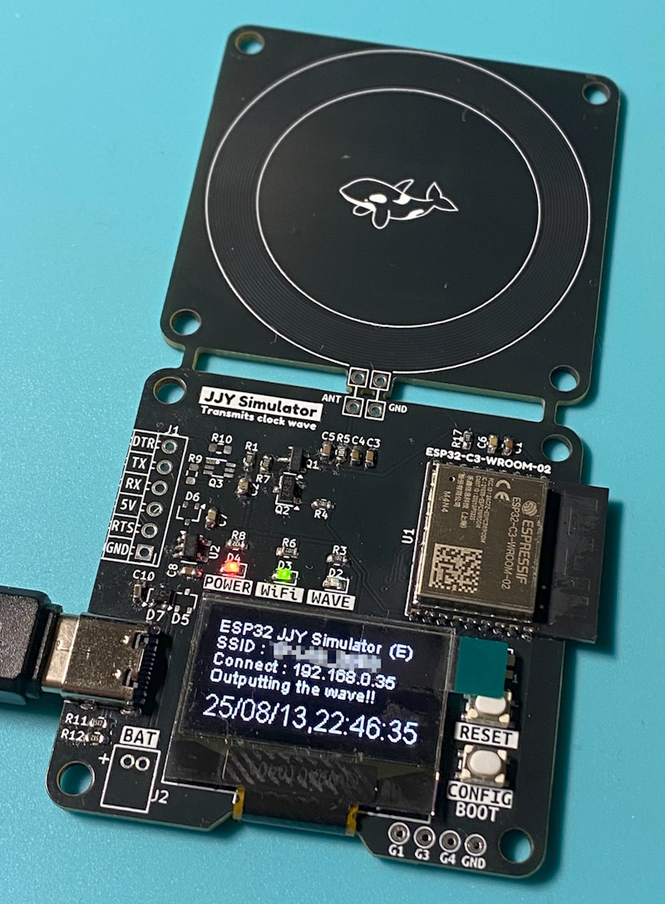

# 📡 JJY Simulator for ESP32-C3

電波時計の補正信号をESP32-C3で自作！
NTPから取得した正確な時刻をもとに、40kHz / 60kHz のJJY信号をPWM出力で模倣する、ミニJJYシミュレーターです。

## 🛠 特徴

- ESP32-C3 + Arduino によるコンパクトな構成
- Wi-Fi設定はボタンひとつで簡単APモード
- OLEDに現在時刻を表示
- PWM出力は GPIO10 から
- JJY 40kHz（東日本）/ 60kHz（西日本）を切り替え可能
- 出力信号は基板内蔵の簡易アンテナから放射

<a href="./images/jjy_sim_board_w800.jpg">
</a><br/>

## ⚙️ 使用方法

### 1. コンパイル・書き込み

1. Arduino IDE で ESP32ボードを有効にする  
   - ボードマネージャURL：`https://dl.espressif.com/dl/package_esp32_index.json`
   - 対象ボード：**ESP32-C3 Dev Module**

2. 必要なライブラリをインストールする  
   - [WiFiManager](https://github.com/tzapu/WiFiManager)（バージョン 2.0.17 推奨）
   - [ESP8266 and ESP32 OLED driver for SSD1306 displays](https://github.com/ThingPulse/esp8266-oled-ssd1306)（バージョン 4.6.0 推奨）

   ※ Arduino IDE の「ライブラリを管理」メニューからインストール可能です。

3. `JJY_Sim_ESP32_C3.ino` を開き、必要に応じて以下を編集：
   - `#define JJY_TYPE 0` → `0: 40kHz`, `1: 60kHz`

4. 書き込みポートとボード設定を確認して、コンパイル＆アップロード

> 💡 補足：
> ESP32-C3は、外付けのUSBシリアルICを使わず、チップ内蔵の**ネイティブUSB-UART**機能で書き込み・シリアル通信を行います。
> 一部の環境（特にWindows）では、デバイス認識のために**Espressif提供のUSBドライバ**が必要になる場合があります。

- ドライバDLページ 👉 https://www.espressif.com/en/support/download/other-tools

### 2. Wi-Fi設定

- 電源投入 or リセット後、5秒以内に CONFIGスイッチを押す
- `ESP32_XXXXXXXX` というAPが起動（パスキー：`password`）
- スマホやPCから接続 → キャプティブポータルでSSID/パスキーを設定

### 3. 動作確認

- 電源投入 or リセット後、5秒間放置すると、WiFiのAPに接続しに行きます。
- APに接続すると、NTPサーバーから時刻を取得します。
- OLEDに現在時刻が表示され、0秒からPWMでJJY信号出力開始
- 電波時計の「受信ボタン」を押して、近くに置いておくだけ！

## 🔌 ピンアサイン（主なもの）

| 機能 | GPIO | 備考 |
|------|------|------|
| JJY PWM出力 | 10 | 変調された信号を出力 |
| CONFIGスイッチ | 9 | Wi-Fi設定用（**BOOTピンと兼用**） |
| ACT LED | 5 | 動作中LED |
| IND LED | 0 | 状態表示用LED（共用可） |
| OLED Reset | 2 | OLEDモジュールリセット |
| OLED SDA|7| OLED I2C データー|
| OLED SCL |6|OLED I2C クロック|


## 🧾 ファイル構成

```
JJY_Sim_ESP32_C3.ino       // メインスケッチ
wire_compat.h              // ESP32-C3 用の I2C バス互換ヘッダ
```

## 📎 依存ライブラリ

- [WiFiManager](https://github.com/tzapu/WiFiManager)
- [ESP8266 and ESP32 OLED driver](https://github.com/ThingPulse/esp8266-oled-ssd1306)

## 🔗 関連リンク

- ブログ記事（詳細解説＋ケースや基板配布）  
  👉 https://blog.shachi-lab.com/033_jjy_simulator/
